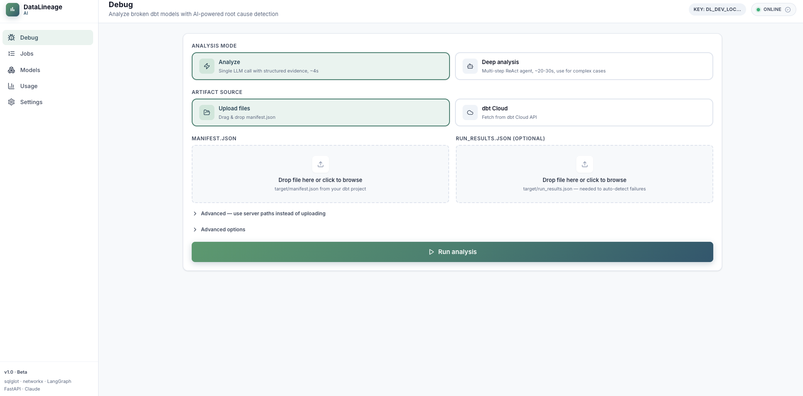
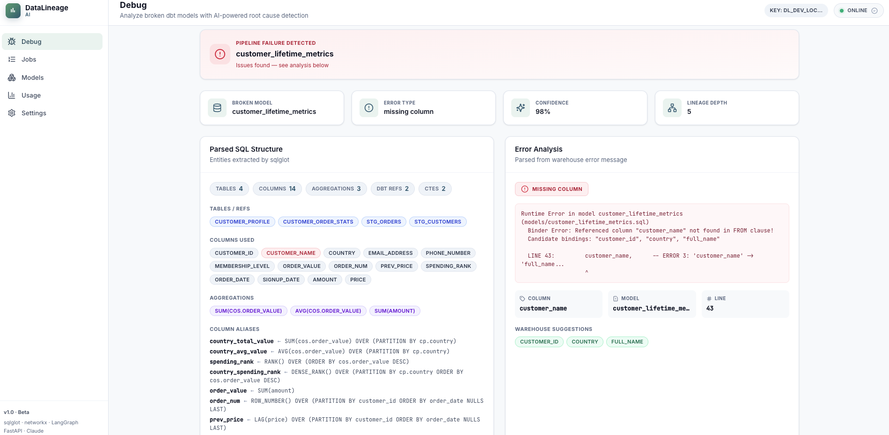
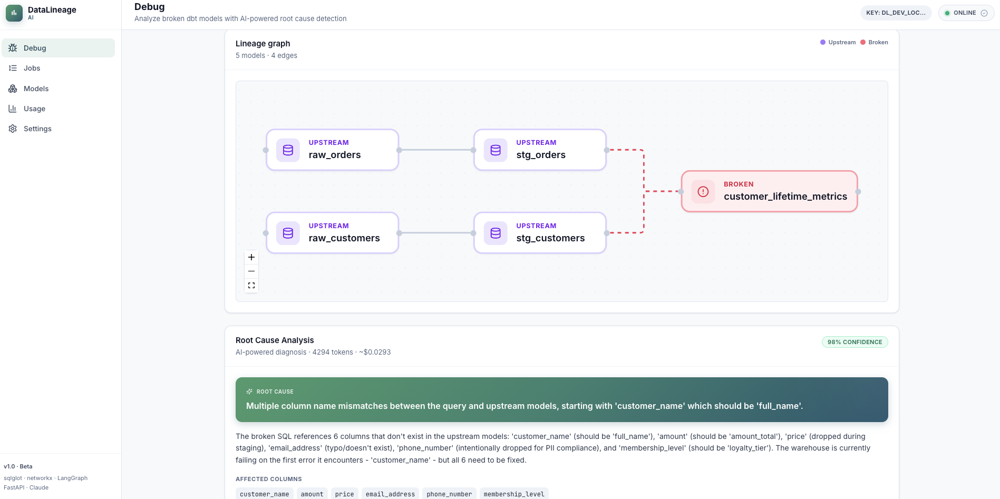
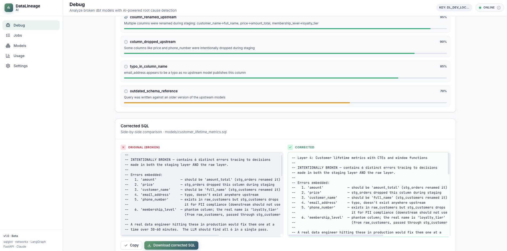
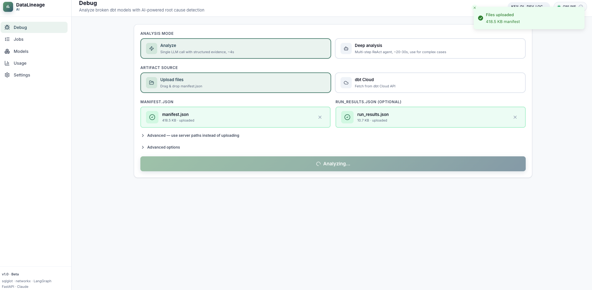
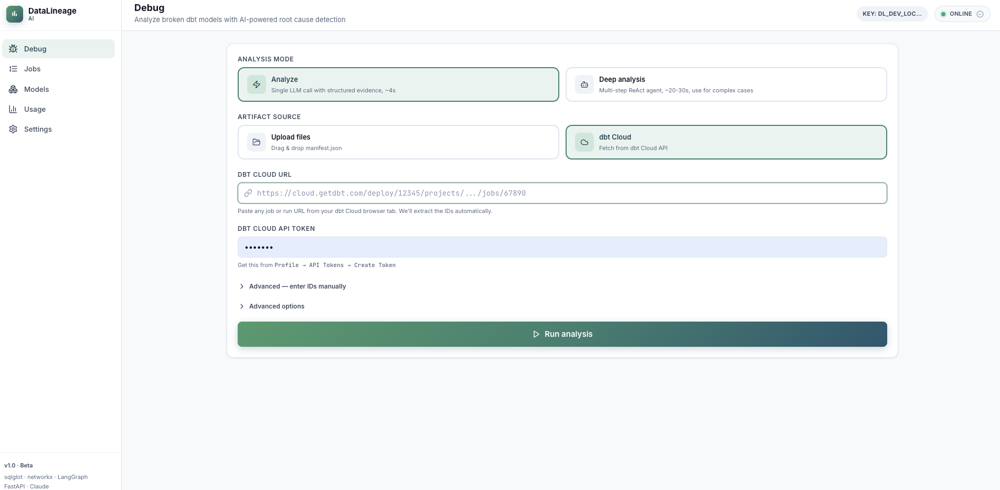
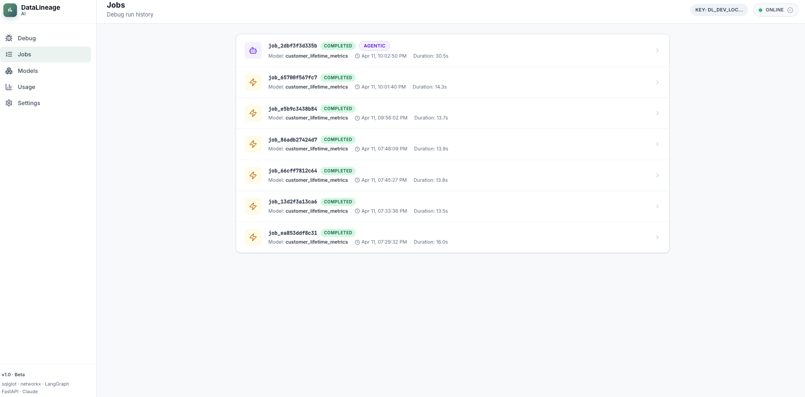
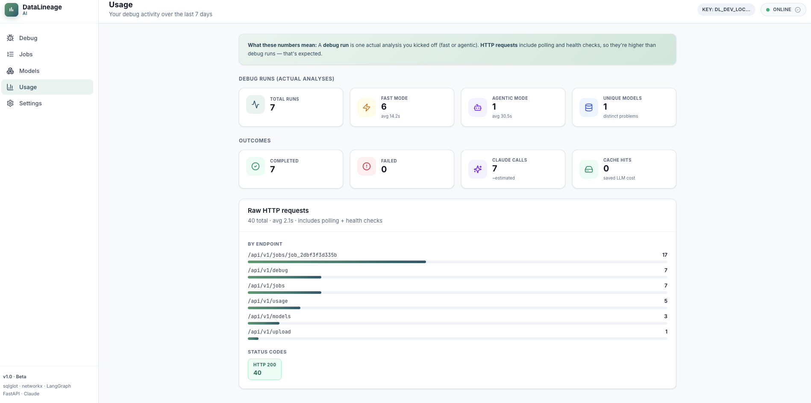

# DataLineage AI - LLM-powered dbt Pipeline Debugger

> **Student Project** · Aishwarya Bhanage · 116556145
> LLM course final project · Stony Brook University

An AI-powered debugger that ingests broken dbt models, reconstructs pipeline
lineage, and produces root-cause diagnoses with auto-corrected SQL - turning
30-minute debugging sessions into a 4-second LLM call.

---

## Why this exists

Data engineers still play **pipeline detective** when dbt jobs fail. The
warehouse returns one error at a time, and tracing the real root cause usually
means opening 5 files, mentally replaying column renames across staging
layers, and hoping the obvious fix isn't masking a deeper issue.

Existing tools surface errors but don't reason about them. This project does.

---

## What it does

Given a broken dbt project (or a dbt Cloud job run), it:

1. **Gathers structured evidence** from `manifest.json` and `run_results.json`
   — the failing model's SQL, its upstream dependencies, their published
   column schemas, and the warehouse error message.
2. **Asks Claude** to reason over the evidence packet and produce a
   structured diagnosis with root cause, corrected SQL, confidence score,
   and validation steps.
3. **Returns the result** as structured JSON and renders it in a React UI
   with lineage DAG, SQL diff, and hypothesis cards.

The LLM is the primary reasoning engine. Deterministic Python code (sqlglot,
networkx, manifest parser) gathers facts; the LLM makes judgments. No
hand-written rule engines, no hard-coded confidence values.

---

## Screenshots

### 1 — Debug page

The main page. Pick an analysis mode (fast or deep) and an artifact source
(file upload or dbt Cloud URL), then hit Analyze.



---

### 2 — Analysis result

Fast mode produces a single-call diagnosis in ~4 seconds with Claude's
confidence score, affected columns, and alternative hypotheses.



---

### 3 — Lineage graph

The dbt dependency DAG, auto-laid-out with dagre. The broken model is
highlighted in red; upstream models in violet.



---

### 4 — Deep analysis (agentic mode)

The optional deep mode spins up a ReAct agent that autonomously decides
which tools to call, in what order, to investigate complex failures.



---

### 5 — File upload

Drag and drop `manifest.json` and `run_results.json` from your local
dbt project. No paths to type.



---

### 6 — dbt Cloud URL input

Paste any dbt Cloud URL and the system extracts account ID, project ID,
and run/job ID automatically.



---

### 7 — Job history

Every analysis is persisted. Jobs page auto-refreshes and shows duration,
mode, and status for every run.



---

### 8 — Usage stats

Per-API-key usage dashboard with debug run counts, fast vs agentic
breakdown, and HTTP request analytics.



---

## High-level architecture

```
  ┌──────────────────────────────────────────────────────────────────┐
  │                   React frontend (Vite)                         │
  │   • Zustand store (settings + in-memory debug state)            │
  │   • TanStack Query (polling, cache)                              │
  │   • React Flow (lineage DAG with dagre auto-layout)              │
  │   • Tailwind v3 (light theme, brand green→teal gradient)        │
  └──────────────────────┬───────────────────────────────────────────┘
                         │ HTTPS + Bearer auth
                         ▼
  ┌──────────────────────────────────────────────────────────────────┐
  │                     FastAPI backend                              │
  │                                                                  │
  │   POST /api/v1/debug        ← main analysis endpoint             │
  │   POST /api/v1/upload       ← drag-and-drop file upload          │
  │   POST /api/v1/debug/cloud  ← dbt Cloud integration              │
  │   GET  /api/v1/jobs/{id}    ← poll async agentic jobs            │
  │   GET  /api/v1/jobs         ← list jobs for caller's key         │
  │   GET  /api/v1/usage        ← per-key usage stats                │
  │   GET  /api/v1/models       ← list models in a manifest          │
  │   GET  /api/v1/health       ← health check (public)              │
  │                                                                  │
  │   Middleware:                                                    │
  │   • API-key auth (Bearer token)                                  │
  │   • Rate limiting (slowapi, per-key)                             │
  │   • Structured logging (structlog → JSON in prod)                │
  │   • Request size limits (50 MB max)                              │
  │   • CORS lockdown                                                │
  └──────────────────────┬───────────────────────────────────────────┘
                         │
        ┌────────────────┼─────────────────┐
        ▼                ▼                 ▼
  ┌──────────┐    ┌──────────────┐   ┌──────────────┐
  │ LangGraph│    │ SQLite +     │   │ Claude API   │
  │ pipeline │    │ SQLAlchemy   │   │ (Sonnet 4)   │
  │          │    │ async        │   │              │
  │ ingest → │    │              │   │ • Fast mode: │
  │ parse  → │    │ • jobs       │   │   1 call     │
  │ lineage →│    │ • usage_log  │   │ • Agentic:   │
  │ llm_anal │    │ • cache      │   │   ReAct loop │
  └──────────┘    └──────────────┘   └──────────────┘
```

### Fast mode pipeline (single LLM call, ~4 seconds, ~$0.013/run)

```
POST /api/v1/debug  (mode=fast)
       │
       ▼
  ingest ───────── load manifest + run_results + find failed model
       │
       ├─────┬────── parallel fan-out
       ▼     ▼
   parse_sql  parse_error
       │     │
       └──┬──┘
          ▼
     build_lineage ─── networkx DAG from manifest.parent_map
          │
          ▼
     llm_analyze ───── ONE Claude call with structured evidence
          │            (failing SQL + upstream columns + error)
          ▼
         END
```

### Agentic mode (opt-in multi-agent ReAct, ~25 seconds, ~$0.15/run)

```
POST /api/v1/debug  (mode=agentic) ──► 202 Accepted + job_id
                                            │
                                            ▼
                        ┌────── background task runs agent ──────┐
                        │                                        │
                        │  Claude as ReAct coordinator           │
                        │                                        │
                        │  Tools available:                      │
                        │    - ingest_dbt_artifacts              │
                        │    - analyze_sql                       │
                        │    - analyze_error                     │
                        │    - get_lineage                       │
                        │    - check_columns_available           │
                        │    - get_model_sql                     │
                        │    - fetch_dbt_cloud_artifacts         │
                        │                                        │
                        │  Loop: Thought → Tool → Observation    │
                        │        until diagnosis is ready        │
                        └────────────────┬───────────────────────┘
                                         │
                                         ▼
                           GET /api/v1/jobs/{id}  (frontend polls)
                                         │
                                         ▼
                            Returns full diagnosis + tool timeline
```

---

## Tech stack

| Layer | Tools |
|-------|-------|
| **Frontend** | React 18 · TypeScript · Vite 5 · Tailwind v3 · Zustand · TanStack Query · React Flow (+ dagre) · Lucide · Sonner |
| **Backend** | FastAPI · LangGraph 1.x · LangChain Anthropic · SQLAlchemy async · slowapi · structlog |
| **LLM** | Claude Sonnet 4 (via Anthropic SDK) |
| **Persistence** | SQLite in dev · Postgres-compatible schema for prod |
| **Data parsing** | sqlglot · networkx · pydantic v2 |
| **dbt** | dbt-core 1.8.7 · dbt-duckdb (bundled demo) · dbt Cloud API client |
| **Ops** | Docker (multi-stage) · AWS App Runner · Secrets Manager · ECR · GitHub Actions |
| **Observability** | structlog JSON logs · per-key usage tracking · request IDs · /health endpoint |

---

## Getting started

### Option A — Run locally with Vite + uvicorn (dev)

```bash
# 1. Python environment
python3 -m venv .venv
source .venv/bin/activate
pip install -r requirements.txt

# 2. Copy env template and add your Anthropic key
cp .env.example .env
# Edit .env — paste your ANTHROPIC_API_KEY

# 3. Generate the bundled dbt demo artifacts
cd dbt_demo && dbt run --profiles-dir . ; cd ..

# 4. Start the backend
API_KEYS="dl_dev_local_key" \
REQUIRE_API_KEY=true \
CORS_ORIGINS="http://localhost:5173" \
uvicorn app.api.main:app --reload --port 8000

# 5. In another terminal, start the React frontend
cd frontend
npm install
npm run dev
```

Then open **http://localhost:5173**, go to Settings, paste the API key
`dl_dev_local_key`, and start analyzing.

### Option B — Run the full app in Docker (single container)

```bash
# Build the multi-stage image (includes the React frontend)
docker build -t datalineage-ai:latest .

# Run with your Anthropic key
docker run --rm -p 9000:8000 \
  -e API_KEYS="dl_dev_local_key" \
  -e ANTHROPIC_API_KEY="$ANTHROPIC_API_KEY" \
  -e REQUIRE_API_KEY=true \
  datalineage-ai:latest

# Open http://localhost:9000 — one URL serves both frontend and API
```

### Option C — Deploy to AWS App Runner

See [**DEPLOY.md**](DEPLOY.md) for a complete step-by-step guide.

Short version:

```bash
# 1. Push image to ECR
aws ecr create-repository --repository-name datalineage-ai
docker tag datalineage-ai:latest <account>.dkr.ecr.<region>.amazonaws.com/datalineage-ai
docker push <account>.dkr.ecr.<region>.amazonaws.com/datalineage-ai

# 2. Store secrets in AWS Secrets Manager
aws secretsmanager create-secret --name datalineage/prod \
  --secret-string '{"ANTHROPIC_API_KEY":"...","API_KEYS":"dl_user1,dl_user2"}'

# 3. Create the App Runner service (see DEPLOY.md for full config)
aws apprunner create-service --cli-input-json file://apprunner-config.json
```

### Testing without a real dbt Cloud account

```bash
# Start the mock dbt Cloud server (no signup required)
python scripts/mock_dbt_cloud.py
# Mimics dbt Cloud API on http://localhost:9090, serves local dbt_demo files
```

Then paste this into the Debug page's dbt Cloud source:
`http://localhost:9090/deploy/12345/projects/67890/jobs/111`

---

## API reference

See [**API.md**](API.md) for full documentation. The core endpoint is:

```bash
curl -X POST https://your-domain/api/v1/debug \
  -H "Authorization: Bearer dl_your_api_key" \
  -H "Content-Type: application/json" \
  -d '{
    "source": "local",
    "manifest_path": "/path/to/target/manifest.json",
    "run_results_path": "/path/to/target/run_results.json",
    "mode": "fast"
  }'
```

Response includes parsed SQL, lineage graph, LLM diagnosis, corrected SQL,
and structured hypotheses.

---

## Project structure

```
.
├── app/
│   ├── api/                       # FastAPI routes + auth + rate limiting
│   │   ├── main.py                # app entry, middleware, static serving
│   │   ├── v1.py                  # all /api/v1/* endpoints
│   │   ├── auth.py                # Bearer token verification
│   │   ├── rate_limit.py          # slowapi per-key limits
│   │   ├── jobs.py                # background task runners
│   │   └── schemas.py             # Pydantic request/response models
│   │
│   ├── core/                      # config + logging
│   │   ├── config.py              # env var loading
│   │   └── logging.py             # structlog setup
│   │
│   ├── dbt/                       # dbt artifact ingestion layer
│   │   ├── manifest_loader.py     # parse manifest.json → typed objects
│   │   ├── run_results_loader.py  # parse run_results.json
│   │   ├── model_resolver.py      # join manifest + run_results
│   │   ├── lineage_builder.py     # networkx DAG builder
│   │   └── cloud_client.py        # dbt Cloud API client
│   │
│   ├── services/                  # deterministic helpers
│   │   ├── sql_parser.py          # sqlglot wrapper
│   │   ├── error_parser.py        # regex error patterns
│   │   └── llm_analyzer.py        # THE LLM reasoner (single Claude call)
│   │
│   ├── graph/                     # LangGraph orchestration
│   │   ├── state.py               # shared TypedDict state
│   │   ├── nodes.py               # 5 node functions
│   │   ├── pipeline.py            # fast-mode graph definition
│   │   ├── agent.py               # agentic mode (ReAct agent)
│   │   └── tools.py               # 7 tools the agent can call
│   │
│   └── db/                        # SQLAlchemy async layer
│       ├── base.py                # engine + session factory
│       ├── models.py              # Job, UsageLog, CacheEntry
│       └── repository.py          # all DB read/write functions
│
├── frontend/                      # React + TypeScript + Tailwind
│   ├── src/
│   │   ├── lib/                   # api client, store, types, utils
│   │   ├── components/            # reusable + page sections
│   │   └── pages/                 # DebugPage, JobsPage, UsagePage, etc.
│   ├── vite.config.ts             # dev server proxy /api → backend
│   └── tailwind.config.js         # brand green→teal gradient theme
│
├── dbt_demo/                      # bundled demo dbt project
│   └── models/
│       ├── raw_orders.sql                  # root
│       ├── raw_customers.sql               # root
│       ├── stg_orders.sql                  # staging (drops 'price')
│       ├── stg_customers.sql               # staging (drops phone_number)
│       ├── customer_revenue.sql            # 1 intentional error
│       └── customer_lifetime_metrics.sql   # 6 intentional errors
│                                           #   (CTEs + window functions)
│
├── scripts/
│   └── mock_dbt_cloud.py          # local mock for dbt Cloud API
│
├── tests/                         # pytest
│   ├── test_sql_parser.py
│   └── test_manifest_and_lineage.py
│
├── .github/workflows/             # CI/CD
│   ├── test.yml                   # pytest on every PR
│   └── deploy.yml                 # build + push to ECR + deploy on main
│
├── Dockerfile                     # multi-stage build
├── .dockerignore
├── .env.example                   # template for ANTHROPIC_API_KEY etc.
├── API.md                         # API reference
├── DEPLOY.md                      # AWS App Runner deployment guide
├── requirements.txt
└── README.md                      # you are here
```

---

## Design decisions

### Why LLM-first instead of a rule engine?

An earlier version of this project used a hand-written rule engine with
hard-coded confidence values (e.g. `column_renamed_upstream = 0.95`). It
worked but didn't scale — every new error pattern required a new rule, and
the "confidence scores" were just educated guesses.

The LLM-first rewrite replaces all of that with a **single structured
prompt**. Deterministic code still gathers evidence (parsing SQL, reading
the manifest, computing lineage), but Claude decides what's wrong and how
to fix it. This handles novel errors the rule engine would miss, while
staying cheap (~$0.01 per run) and fast (~4 seconds).

### Why both fast mode and agentic mode?

**Fast mode** is one LLM call with pre-built context. Good for 90% of
cases — column renames, missing columns, type mismatches — where the
answer fits in a single reasoning pass.

**Agentic mode** is a ReAct loop where Claude has 7 tools and decides
the investigation order itself. Slower and more expensive, but handles
complex multi-layer failures and novel patterns fast mode misses.

The trade-off is documented in code so the user can pick the right mode
for each case.

### Why context engineering instead of full tool-calling?

The naive approach is to give Claude all 7 tools and let it discover
everything through tool calls. That works but takes 25+ seconds and
~$0.30 per run.

The smart approach is to pre-build a structured evidence packet
deterministically (cheap) and send it to Claude as context (one call).
That's 10x faster and 25x cheaper for the common case.

Both approaches are implemented. Fast mode uses context engineering;
agentic mode uses tool calling. Users can choose.

### Privacy and self-hosting

The hosted version sends structured evidence (failing SQL + upstream
column schemas — **not the full manifest**) to Claude. The full manifest
is read server-side only.

For enterprise use where even partial SQL can't leave the network, the
Docker image can be self-hosted. The architecture supports a "bring your
own LLM" configuration — replace the Anthropic client with a local model
via Ollama or AWS Bedrock.

---

## Testing

```bash
pytest tests/ -v
```

26 tests covering the manifest loader, lineage builder, and SQL parser.
Integration tests against the bundled `dbt_demo` project verify
end-to-end behavior.

---

## What's not built yet (honest limitations)

- **No user signup/login** — users get pre-issued API keys. Good enough
  for a private beta; would need proper auth for public launch.
- **SQLite in prod** — fine for a beta container, but history is lost
  on restart. Migrating to Postgres is a one-line config change.
- **No streaming responses** — agentic mode polls rather than streams.
- **No local LLM mode yet** — currently Anthropic-only. The code has
  one integration point (`app/services/llm_analyzer.py`) that could be
  extended to support Ollama or AWS Bedrock.

---

## Contact & feedback

This is a student project built for an LLM course. Feedback, issues, and
PRs welcome.

**Course**: LLM course · Stony Brook University
**Author**: Aishwarya Bhanage
